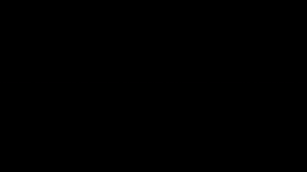
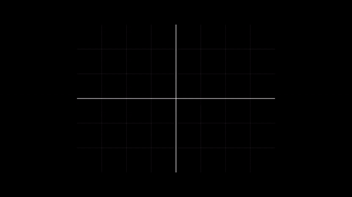
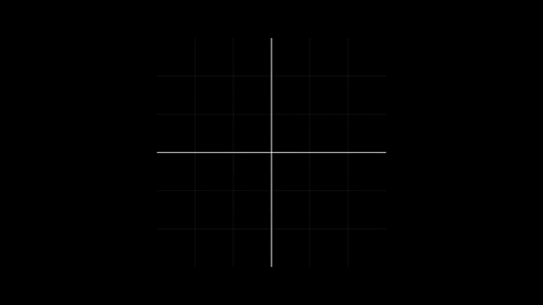

# RCS Visualizations

Animated companion to a Physical-Optics radar cross-section solver —
short Manim scenes that explain *why* stealth aircraft shapes look the
way they do. Each scene corresponds to one piece of the RCS pipeline,
from triangular-facet phase summation to topology optimization.

> Pair this with [**nighthawk_rcs**](https://github.com/pmazumder3927/nighthawk_rcs)
> for the actual physical-optics simulator and topology optimizer. This
> repo is the geometry-and-physics intuition behind the equations
> nighthawk_rcs is solving numerically.

---

## The pieces

### Radar facets — scattering from a triangular mesh



Physical-optics codes turn a smooth body into a triangular mesh, then
compute scattering one facet at a time. For each facet, the solver
checks whether the incident wave illuminates it (`-k_i · n > 0`),
multiplies by the local surface current, and weights by the phase
`exp(i k · r)` so contributions from different facets interfere
correctly. A sphere is just an icosahedron with enough subdivisions.

### Reflection from a flat plate — the specular spike


A flat metallic plate normal to the radar is the worst-case stealth
geometry: every point on the plate reflects with the same phase, so the
contributions add coherently and the return is enormous (`σ ∝ A² / λ²`).
Tilt the plate, scatter the energy somewhere else, and that coherent
spike collapses — the whole point of faceted shapes like the F-117.

### Facet H-field — what the integrand looks like



Zooming in on a single triangle, the physical-optics approximation
replaces the true surface current with `J_s ≈ 2 n × H_inc` (PEC
assumption). The scattered field from this facet is then a Fourier-like
integral over its area. This scene shows the incident `H` vector
landing on one tile of the mesh.

### Scattered field — the coherent sum


Sum every illuminated facet's contribution, weighted by area `A_i`,
surface current `J_{s,i}`, and the path-difference phase `e^{j k r_i}`,
and you get the body's scattered field in the observer direction. This
sum is what an RCS solver is actually computing.

### Wave vectors and destructive interference



Shape optimizers exploit the phase term: shift a vertex by `Δr` and
that facet's contribution rotates around the unit circle. Pick
deformations that drive contributions toward `180°` opposition and the
backscatter cancels. "Stealthy" geometry is geometry where the coherent
sum nearly vanishes in the threat direction.

### Creeping waves — the return PO misses


Pure physical optics only captures the directly-illuminated face of a
body. Real radar returns also include surface currents that creep
around the shadowed side and re-radiate — the orange tangential paths
in this scene. For curved bodies near grazing incidence, the creeping
contribution can be 50 % of the total return, which is why diffraction
and surface-wave corrections matter even on otherwise-stealthy shapes.

---

## How the scenes are wired up

Seven Manim scenes, registered in `scenes/registry.py`:

| Scene name             | Class                              | Topic                                   |
| ---------------------- | ---------------------------------- | --------------------------------------- |
| Radar Facets           | `RadarFacetsVisualization`         | Faceted body + illumination + phase     |
| Deformation Vectors    | `DeformationVectorsVisualization`  | Per-vertex offsets driving shape change |
| Voxel Topology         | `VoxelTopologyVisualization`       | Density-based topology optimization     |
| Optimizer Comparison   | `OptimizerComparisonVisualization` | Gradient descent vs Adam on RCS loss    |
| Creeping Waves Basic   | `CreepingWavesVisualization`       | 4-step creeping-wave story              |
| Creeping Waves Enhanced| `CreepingWavesEnhanced`            | Extended EM + diffraction walkthrough   |
| Topology Optimization  | `TopOptRCS`                        | Toy RCS-driven shrink-the-rear demo     |

Common visual identity (background colour, default camera, title cards,
HUD text bookkeeping) lives in `scenes/_common.py` so a new scene only
has to describe its physics.

## Render your own

```bash
pip install -r requirements.txt

./render --list                  # see registered scenes
./render all --parallel -q high  # render everything in parallel
./render "Radar Facets" -q low   # render just one, fast preview
./render                         # interactive menu
```

Output lands under `media/videos/<scene>/<resolution>/<Class>.mp4`. See
[`docs/rendering.md`](docs/rendering.md) for quality presets, speed
knobs, and the recipe for adding a new scene.

## Repo layout

* `scenes/` — one file per visualization plus `_common.py` for shared
  setup and `registry.py` listing every scene the renderer should know
  about.
* `scripts/` — `render.py` (the universal renderer behind `./render`)
  and `clean.py` for the Manim media cache.
* `docs/img/` — the preview GIFs above. Source of truth for the README.

## License

MIT — see [LICENSE](LICENSE).
